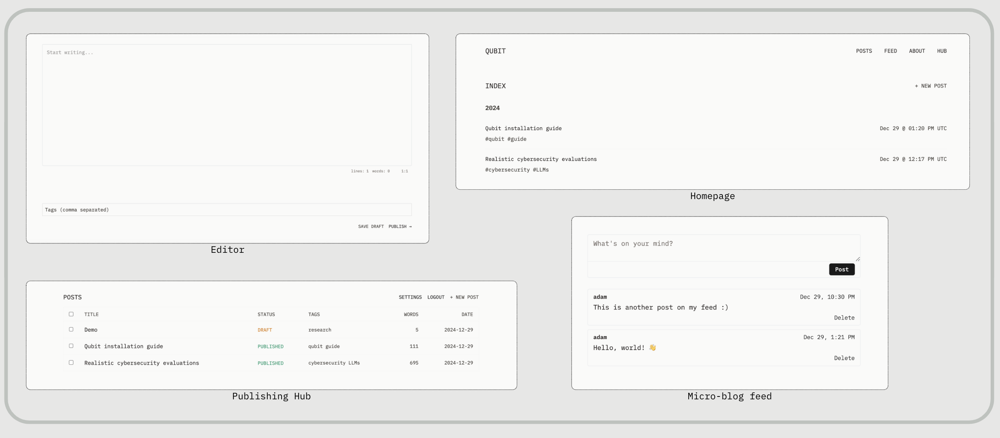

# qubit

Modern social platforms shape how we write and share. But sometimes you just want a quiet corner of the internet to document your thoughts and learnings.

Inspired by the simplicity of "Today I Learned" blogs and the clean aesthetics of platforms like [WriteFreely](https://writefreely.org/) and [Article.app](https://article.app/), Qubit is built for developers and tinkerers who want to focus on writing without the pressure of metrics, algorithms, or engagement statistics.

Write short notes about what you're building. Share useful resources you've discovered. Document your learning journey.

No follower counts, no likes, no retweets — just thoughts and code in clean, monospaced type.



## ✨ Features

- Clean, distraction-free writing experience
- Markdown editor with live preview
- Tag-based organization
- Semantic search with pgvector
- Modern, minimal frontend

## 🚀 Quick Start

Follow the quick start guide below to run Qubit with Docker compose, or full the manual installation steps on [the documenation site](https://qubit.deadbits.ai).

1. Clone the repository

```bash
git clone https://github.com/deadbits/qubit
cd qubit
```

2. Create a `.env` file in the `docker` directory

```bash
# docker/.env
DB_PASSWORD=your_secure_password_here
AUTH_SECRET_KEY=your_secret_key_here
OPENAI_API_KEY=your_openai_key_here
ADMIN_USERNAME=admin
ADMIN_EMAIL=admin@example.com
ADMIN_PASSWORD=your_admin_password
```

3. Configure your author details in `data/config.yaml`

The `data/config.yaml` file controls your blog's author details and bio on the `About` page.

```yaml
author:
  name: Adam Swanda
  short_name: adam
  bio: >
    Security researcher and developer focused on AI/ML security, threat intelligence, and building tools that help people research and create.
  github: deadbits
  website: https://www.deadbits.org
  linkedin: https://www.linkedin.com/in/adamswanda/
```

4. Start the application with Docker

```bash
docker compose up -d --build
```

That's it! You can login to Qubit at [http://localhost:8000/login](http://localhost:8000/login).